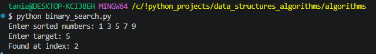

#  Data Structures & Algorithm Patterns for LeetCode

##  Overview
This project contains implementations of common **Data Structures & Algorithms (DSA) patterns** used in coding interviews.  
The goal is to practice problem-solving and improve algorithmic thinking.

---

## 🚀 Implemented Patterns

-  Binary Search  
-  Find Minimum in Rotated Sorted Array  
-  Two Pointers  
-  Sliding Window (Fixed)  
-  Backtracking (Subsets)  
-  Breadth-First Search (BFS)  
-  Hash Map (Two Sum)    

---

##  Implementations & Outputs Examples
 🔹 Binary Search
```
def binary_search(nums, target):
    left, right = 0, len(nums) - 1
    while left <= right:
        mid = (left + right) // 2
        if nums[mid] == target:
            return mid
        elif nums[mid] < target:
            left = mid + 1
        else:
            right = mid - 1
    return -1
```
Output:
<p align="center">  </p>

 🔹 Find Minimum in Rotated Sorted Array
```
def find_min_rotated(arr:list[int])-> int:
    left, right = 0, len(arr) - 1
    boundary_index = -1
    while left <= right:
        mid = (left + right) // 2
        # if <= last element, then belongs to lower half
        if arr[mid]<=arr[-1]:
            boundary_index=mid
            right = mid - 1
        else:
            left = mid + 1
    return boundary_index
```
Output:
<p align="center">  </p>
