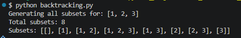
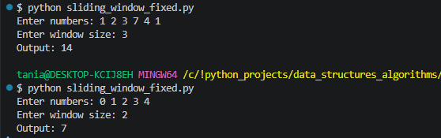

#  Data Structures & Algorithm Patterns for LeetCode

##  Overview
This project contains implementations of common **Data Structures & Algorithms (DSA) patterns** used in coding interviews.  
The goal is to practice problem-solving and improve algorithmic thinking.

---

## 🚀 Implemented Patterns

-  Binary Search  
-  Find Minimum in Rotated Sorted Array  
-  Two Pointers  
-  Sliding Window (Fixed)  
-  Backtracking (Subsets)  
-  Breadth-First Search (BFS)  
-  Hash Map (Two Sum)    

---

## 🧾 Implementations & Outputs Examples


## 🔹 Binary Search

```python
def binary_search(nums, target):
    left, right = 0, len(nums) - 1

    while left <= right:
        mid = (left + right) // 2

        if nums[mid] == target:
            return mid
        elif nums[mid] < target:
            left = mid + 1
        else:
            right = mid - 1

    return -1

```
🖼 Output
<p align="center">  </p>

 ## 🔹 Find Backtracking
 
```python
def find_subsets(nums):
    result = []

    def backtrack(start, path):
        result.append(list(path))

        for i in range(start, len(nums)):
            path.append(nums[i])
            backtrack(i + 1, path)
            path.pop()  # Backtrack step

    backtrack(0, [])
    return result

```
🖼 Output
<p align="center"> </p>

 ## 🔹 Sliding Window
 
```python
def sliding_window_fixed(nums, k):
    window_sum = sum(nums[:k])
    max_sum = window_sum

    for right in range(k, len(nums)):
        left = right - k
        window_sum += nums[right] - nums[left]
        max_sum = max(max_sum, window_sum)

    return max_sum

```
🖼 Output
<p align="center"> </p>

